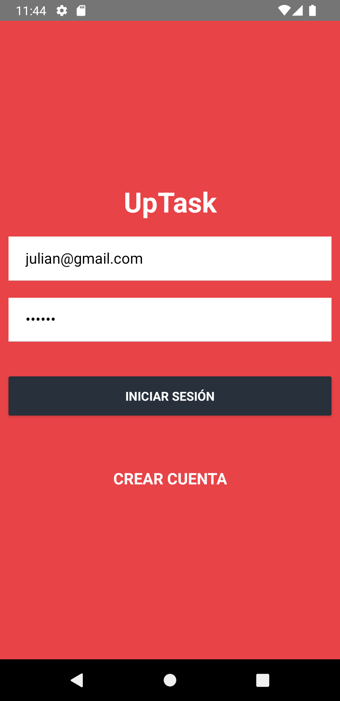
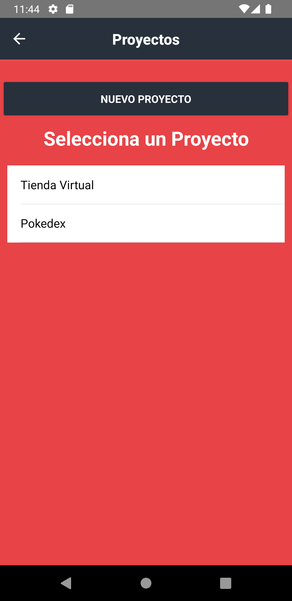
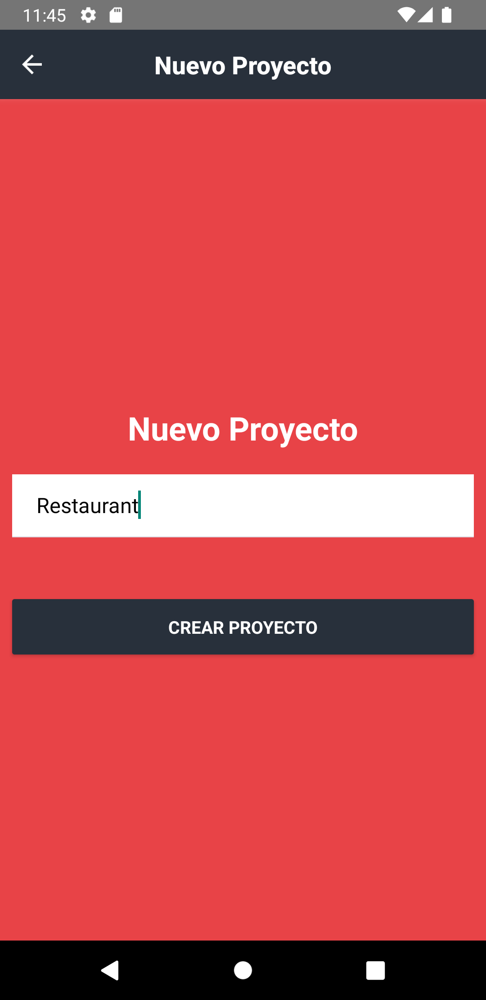
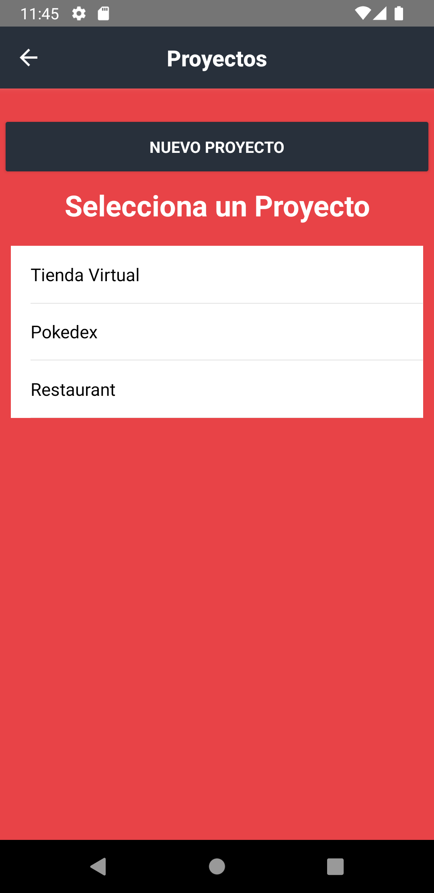
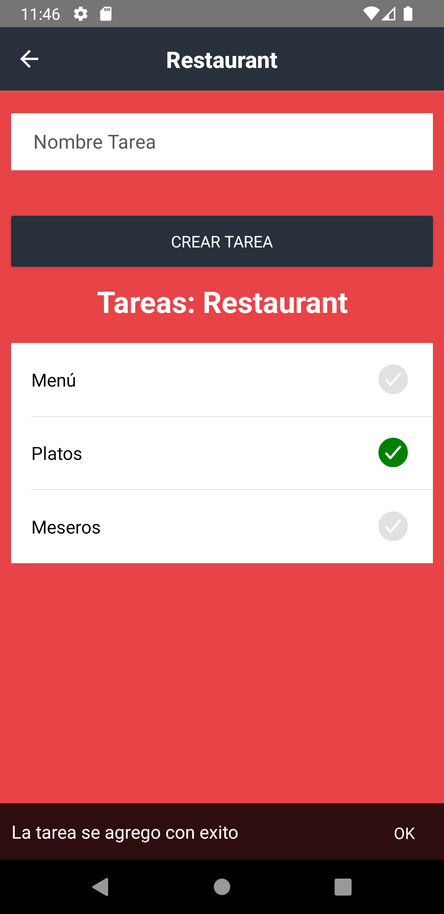
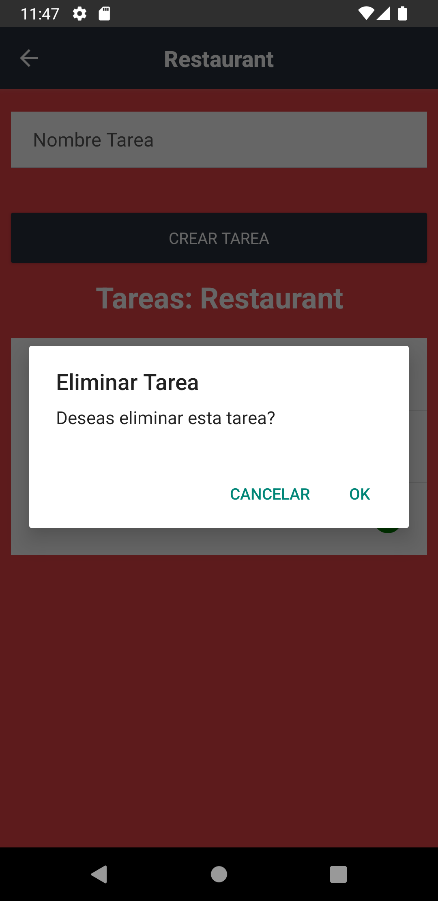
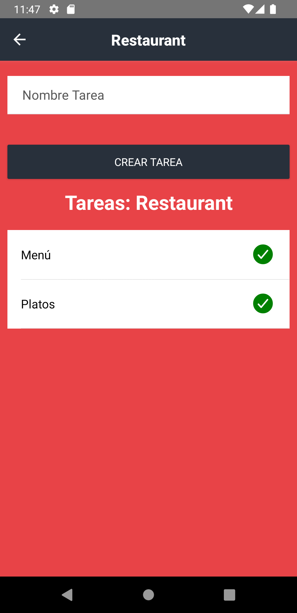

# upTaskNative
This APP let the users create and supervise projects connected to a DataBase created with MongoDB, where the user login with email and password, to manage their projects 
Consult the repository [upTaskGraphQL](<https://github.com/Jare9716/upTaskGraphQL.git>) for the DataBase code. 

# Libraries

This project has the next libraryes:

1. apollo/client
2. react-native-async-storage/async-storage
3. react-navigation/native"
4. eact-navigation/stack
5. deprecated-react-native-prop-types
6. graphql
7. link
8. native-base "2.15.2"

***Don't forget to install all the libraries and dependencies to run the project***

# Images

 &nbsp;&nbsp;&nbsp;&nbsp;
 &nbsp;&nbsp;&nbsp;&nbsp;
 &nbsp;&nbsp;&nbsp;&nbsp;

 &nbsp;&nbsp;&nbsp;&nbsp;
 &nbsp;&nbsp;&nbsp;&nbsp;
 &nbsp;&nbsp;&nbsp;&nbsp;

 &nbsp;&nbsp;&nbsp;&nbsp;

  
# Notes

* This project works only with the library `native-base 2` version, so is necessary to install the `deprecated-react-native-prop-types` library 

# Youtube Video

<https://youtu.be/GP80lAe_Xs0>
